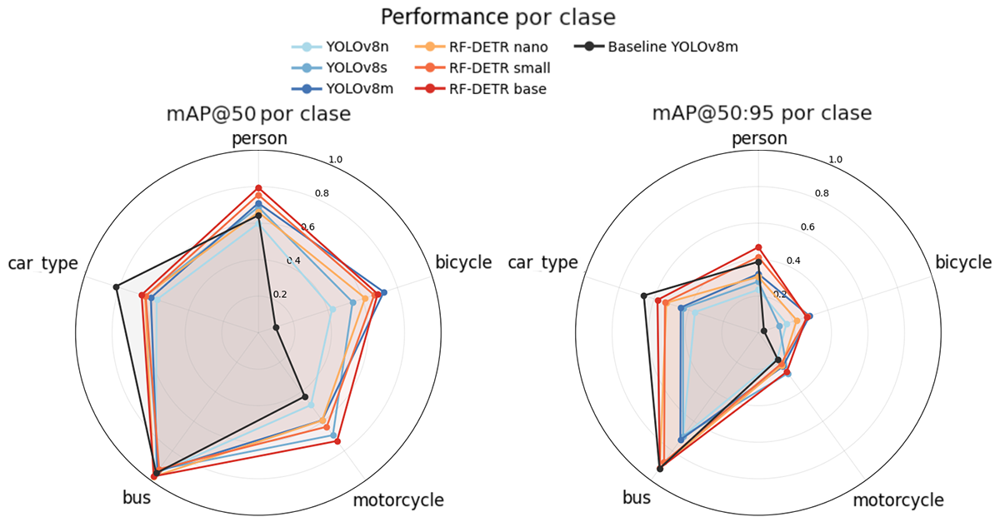
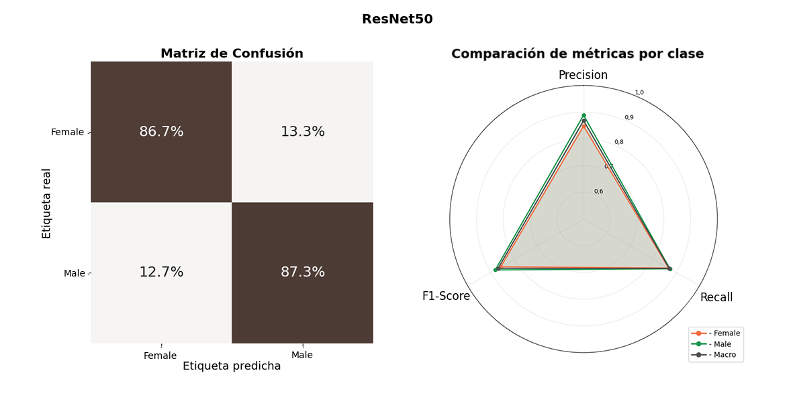

# Cyclist Census

Computer vision research for automated cyclist counting and demographic analysis from urban CCTV footage - methodology, findings, and implementation links

## Overview

This research project presents an end-to-end computer vision pipeline for automated cyclist census generation from urban CCTV footage. The system combines state-of-the-art object detection (YOLO/RFDETR), multi-object tracking (ByteTrack), and deep learning-based classification (EfficientNet/ResNet) to produce detailed cyclist mobility data including gender demographics and bike lane compliance metrics.

Developed to support urban transportation planning and policy decisions, the pipeline processes hours of video footage to generate temporal count data that would be prohibitively expensive to collect manually. The system handles challenging real-world conditions including variable lighting, occlusions, and high traffic density typical of urban intersections.

Key capabilities include directional counting across multiple lanes, real-time gender classification with temporal aggregation, automated bike lane compliance tracking, and checkpoint-based processing designed for resource-constrained environments (Google Colab free tier). The complete methodology spans dataset preparation, model training, hyperparameter optimization, and production deployment.

## Sample Results

*Real-time cyclist detection, tracking, and demographic classification with directional counting*

## Implementation Repositories

This research repository documents the methodology and findings. The complete implementation is organized across five interconnected repositories:

| Repository | Purpose | Key Technologies |
|------------|---------|------------------|
| [**cctv-inference**](https://github.com/jcruz-ferreyra/cctv-inference) | Production inference pipeline for processing CCTV videos | PyTorch, Supervision, ByteTrack, YOLO/RFDETR |
| [**detection-labelling**](https://github.com/jcruz-ferreyra/detection-labelling) | Dataset preparation for object detection training | SIFT, BYOL, Supervision |
| [**detection-training**](https://github.com/jcruz-ferreyra/detection-training) | Training and evaluation of detection models | YOLO, RFDETR, MLflow |
| [**classification-labelling**](https://github.com/jcruz-ferreyra/classification-labelling) | Dataset preparation for classification training | Supervision, OpenCV |
| [**classification-training**](https://github.com/jcruz-ferreyra/classification-training) | Training and optimization of CNN classifiers | EfficientNet, ResNet, Optuna, MLflow |

Each repository contains detailed documentation, configuration examples, and usage instructions.

 

## Research Context

### Institution

**Universidad de Buenos Aires (University of Buenos Aires)**

This project was completed as the capstone project for the [Graduate Specialization in Artificial Intelligence](https://lse-posgrados.fi.uba.ar/posgrados/especializaciones/ceia) at the School of Engineering, University of Buenos Aires. The specialization serves as the first-year intermediate degree toward the [Master's in Artificial Intelligence](https://lse-posgrados.fi.uba.ar/posgrados/maestrias/mia) at the same institution. The project was submitted for approval and grading in October 2025.

### Collaboration

**Ente de la Movilidad de Rosario (Rosario Mobility Authority)**

This research was conducted in collaboration with the Rosario Mobility Authority, where the author worked as a Transportation Data Scientist from November 2022 to August 2024 before pursuing graduate studies abroad. The Ente de la Movilidad is an autonomous decentralized agency responsible for comprehensive urban mobility management across all transportation modes, including mass transit, individual and special transport services, non-motorized transport, and private vehicle use. The organization is characterized by its technical expertise and multidisciplinary approach to addressing mobility challenges through evidence-based, sustainability-focused policies.

### Project Motivation

The Rosario Mobility Authority conducts manual cyclist censuses at strategic locations throughout the city. Field workers observe traffic flow at selected intersections during 15-minute intervals, recording counts on paper forms. Data collection includes vehicle counts by category (cars, buses, motorcycles, bicycles, scooters), infrastructure compliance (bike lane vs. roadway usage), bicycle type (personal vs. public bike-share), and demographic characteristics (gender, age group) of cyclists.

These censuses are essential for urban mobility decision-making, providing systematic data to evaluate infrastructure performance, identify high-traffic zones for prioritized improvements, and design evidence-based public policies. Consistent periodic collection enables temporal analysis to monitor transportation system evolution, identify trends, and evaluate intervention impacts over time.

However, the manual methodology presents significant limitations:

- **Resource intensive**: Requires substantial human resources through temporary census workers or reassignment of qualified technical staff to tasks that underutilize their expertise
- **Verification challenges**: Difficult to validate anomalous or inconsistent data post-collection without the ability to review the original scene
- **Human error**: Subject to recording mistakes and subjective interpretation variability, particularly in demographic classification
- **Safety constraints**: Urban security concerns prevent data collection in certain areas or times of day, limiting spatial and temporal coverage

This context motivates the exploration of technological alternatives to automate cyclist censuses using existing infrastructure—specifically, the city's CCTV surveillance camera network. Reliable, accurate, and frequent cyclist mobility data is fundamental for planning adequate infrastructure, improving road safety, evaluating public policies, and promoting sustainable transportation. Computer vision-based automation represents a concrete opportunity to modernize data collection systems and advance toward more intelligent urban mobility management.

 

## Pipeline Overview

The complete pipeline transforms raw CCTV footage into actionable cyclist census data through five interconnected stages. Each stage addresses a specific challenge in the automated analysis workflow, from initial data preparation through final deployment.

---

### 1. Detection Dataset Preparation [↗️](https://github.com/jcruz-ferreyra/detection-labelling)

  

Multi-stage pipeline for preparing detection datasets from CCTV videos. Extracts frames, performs intelligent sampling, removes duplicates, and generates training-ready annotations in multiple formats (YOLO, COCO). Designed to create high-quality, diverse datasets for urban vehicle detection tasks.

### 2. Detection Model Training [↗️](https://github.com/jcruz-ferreyra/detection-training)

  

Complete training infrastructure for object detection models on urban CCTV footage. Combines multiple annotation sources, trains YOLO and RFDETR models with experiment tracking, and provides detailed evaluation metrics.

### 3. Classification Dataset Preparation [↗️](https://github.com/jcruz-ferreyra/classification-labelling)

  

Extracts and organizes image crops from object detection datasets for classification tasks. Focuses on extracting people detections with spatial filtering and automatic motorcyclist separation. Designed to create balanced, clean classification datasets from existing detection annotations.

### 4. Classification Model Training [↗️](https://github.com/jcruz-ferreyra/classification-training)

  

Complete training infrastructure for CNN classification models on cropped detection images. Combines multiple image sources, performs hyperparameter optimization, trains EfficientNet and ResNet models with experiment tracking, and evaluates with threshold optimization.

### 5. Inference Pipeline [↗️](https://github.com/jcruz-ferreyra/cctv-inference)

  

Offline CCTV video processing pipeline that detects, tracks, and counts vehicles while capturing cyclist gender demographics and bike lane compliance data. Designed for urban transportation research and planning.

 

## Results

### Evaluation Methodology

Model performance was evaluated on test datasets derived from CCTV footage not used during training, ensuring assessment of generalization to truly unseen data. For detection evaluation, only the front portion of frames (approximately 50 meters depth) was used for testing, matching the expected operational depth in production deployment.

Detection models were evaluated on the vehicle categories used by the Ente de la Movilidad for census operations: person, bicycle, motorcycle, bus, and car-type (aggregating car, truck, and the newly introduced van class).

---

### Detection Performance

  

The trained detection model significantly outperforms the baseline (out-of-the-box YOLOv8m) across most categories, with substantial improvement in the primary class of interest: bicycles. The trained model achieves similar or higher mAP@50 and mAP@95 scores for person, motorcycle, and bus detections.

Performance for the car-type category is lower than baseline, primarily due to the introduction of the van class with limited representation in the training dataset. This causes occasional misclassification between van and the pre-existing car class from the baseline model. However, these errors do not impact current institutional requirements, and the van class introduction establishes groundwork for future project iterations. Additional analysis is available in the [full report](reports/cyclist_census_[sp].pdf) (Spanish).

---

### Classification Performance

  

The ResNet50 model was selected for deployment based on its optimal balance between classification performance and inference speed. A key methodological contribution involved adjusting the decision threshold on the validation set to balance per-class recall rather than simply maximizing macro F1 score. In binary classification, optimizing for averaged metrics can mask significant performance disparities between classes—a model might achieve 95% recall on males but only 70% on females (incorreclty identifying the remaining 30% as males) while maintaining acceptable macro scores. Such imbalance would systematically bias census data, overcounting one demographic group. Threshold tuning ensures errors distribute evenly across both classes, producing unbiased demographic estimates.

Threshold optimization revealed that all models required thresholds shifted toward the male class extreme, indicating that male classification is less challenging—likely due to lower variance in appearance and clothing characteristics. The deployed ResNet50 model achieves approximately 87% recall for both gender classes, ensuring balanced performance that supports unbiased census data generation.

---

### Inference Demonstration

  

*Real-time cyclist census generation showing object detection, multi-object tracking with persistent IDs, gender classification, directional counting across multiple traffic lanes, and bike lane compliance tracking. Click the image above to watch the full demonstration video. The system processes CCTV footage to produce temporal count data aggregated at 15-minute intervals.*

---

