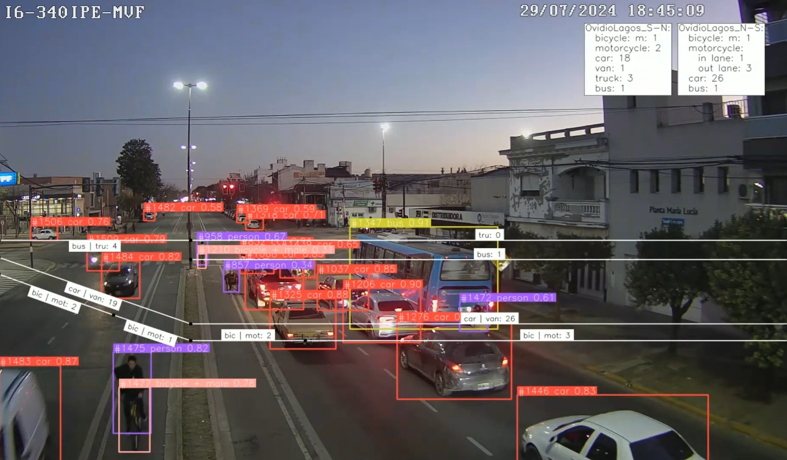
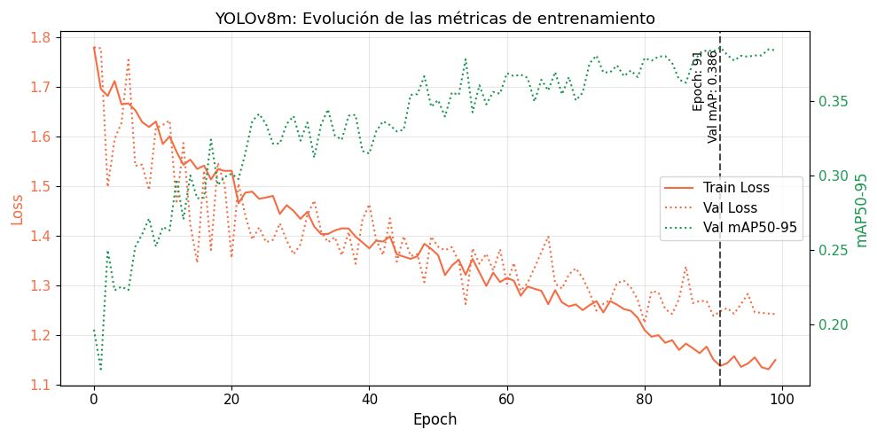
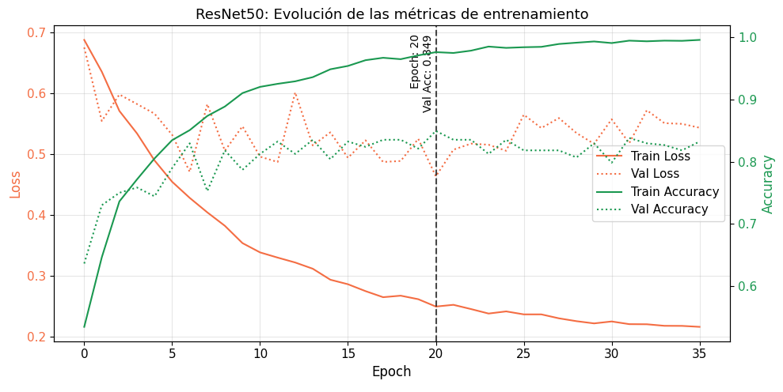

# Cyclist Census

Computer vision research for automated cyclist counting and demographic analysis from urban CCTV footage - methodology, findings, and implementation links

## Overview

This research project presents an end-to-end computer vision pipeline for automated cyclist census generation from urban CCTV footage. The system combines state-of-the-art object detection (YOLO/RFDETR), multi-object tracking (ByteTrack), and deep learning-based classification (EfficientNet/ResNet) to produce detailed cyclist mobility data including gender demographics and bike lane compliance metrics.

Developed to support urban transportation planning and policy decisions, the pipeline processes hours of video footage to generate temporal count data that would be prohibitively expensive to collect manually. The system handles challenging real-world conditions including variable lighting, occlusions, and high traffic density typical of urban intersections.

Key capabilities include directional counting across multiple lanes, real-time gender classification with temporal aggregation, automated bike lane compliance tracking, and checkpoint-based processing designed for resource-constrained environments (Google Colab free tier). The complete methodology spans dataset preparation, model training, hyperparameter optimization, and production deployment.

## Sample Results

*Real-time cyclist detection, tracking, and demographic classification with directional counting*

## Implementation Repositories

This research repository documents the methodology and findings. The complete implementation is organized across five interconnected repositories:

| Repository | Purpose | Key Technologies |
|------------|---------|------------------|
| [**cctv-inference**](https://github.com/jcruz-ferreyra/cctv-inference) | Production inference pipeline for processing CCTV videos | PyTorch, Supervision, ByteTrack, YOLO/RFDETR |
| [**detection-labelling**](https://github.com/jcruz-ferreyra/detection-labelling) | Dataset preparation for object detection training | SIFT, BYOL, Supervision |
| [**detection-training**](https://github.com/jcruz-ferreyra/detection-training) | Training and evaluation of detection models | YOLO, RFDETR, MLflow |
| [**classification-labelling**](https://github.com/jcruz-ferreyra/classification-labelling) | Dataset preparation for classification training | Supervision, OpenCV |
| [**classification-training**](https://github.com/jcruz-ferreyra/classification-training) | Training and optimization of CNN classifiers | EfficientNet, ResNet, Optuna, MLflow |

Each repository contains detailed documentation, configuration examples, and usage instructions.

 

## Research Context

### Institution

**Universidad de Buenos Aires (University of Buenos Aires)**

This project was completed as the capstone project for the [Graduate Specialization in Artificial Intelligence](https://lse-posgrados.fi.uba.ar/posgrados/especializaciones/ceia) at the School of Engineering, University of Buenos Aires. The specialization serves as the first-year intermediate degree toward the [Master's in Artificial Intelligence](https://lse-posgrados.fi.uba.ar/posgrados/maestrias/mia) at the same institution. The project was submitted for approval and grading in October 2025.

### Collaboration

**Ente de la Movilidad de Rosario (Rosario Mobility Authority)**

This research was conducted in collaboration with the Rosario Mobility Authority, where the author worked as a Transportation Data Scientist from November 2022 to August 2024 before pursuing graduate studies abroad. The Ente de la Movilidad is an autonomous decentralized agency responsible for comprehensive urban mobility management across all transportation modes, including mass transit, individual and special transport services, non-motorized transport, and private vehicle use. The organization is characterized by its technical expertise and multidisciplinary approach to addressing mobility challenges through evidence-based, sustainability-focused policies.

### Project Motivation

The Rosario Mobility Authority conducts manual cyclist censuses at strategic locations throughout the city. Field workers observe traffic flow at selected intersections during 15-minute intervals, recording counts on paper forms. Data collection includes vehicle counts by category (cars, buses, motorcycles, bicycles, scooters), infrastructure compliance (bike lane vs. roadway usage), bicycle type (personal vs. public bike-share), and demographic characteristics (gender, age group) of cyclists.

These censuses are essential for urban mobility decision-making, providing systematic data to evaluate infrastructure performance, identify high-traffic zones for prioritized improvements, and design evidence-based public policies. Consistent periodic collection enables temporal analysis to monitor transportation system evolution, identify trends, and evaluate intervention impacts over time.

However, the manual methodology presents significant limitations:

- **Resource intensive**: Requires substantial human resources through temporary census workers or reassignment of qualified technical staff to tasks that underutilize their expertise
- **Verification challenges**: Difficult to validate anomalous or inconsistent data post-collection without the ability to review the original scene
- **Human error**: Subject to recording mistakes and subjective interpretation variability, particularly in demographic classification
- **Safety constraints**: Urban security concerns prevent data collection in certain areas or times of day, limiting spatial and temporal coverage

This context motivates the exploration of technological alternatives to automate cyclist censuses using existing infrastructure—specifically, the city's CCTV surveillance camera network. Reliable, accurate, and frequent cyclist mobility data is fundamental for planning adequate infrastructure, improving road safety, evaluating public policies, and promoting sustainable transportation. Computer vision-based automation represents a concrete opportunity to modernize data collection systems and advance toward more intelligent urban mobility management.

 

## Pipeline Overview

The complete pipeline transforms raw CCTV footage into actionable cyclist census data through five interconnected stages. Each stage addresses a specific challenge in the automated analysis workflow, from initial data preparation through final deployment.

---

### 1. Detection Dataset Preparation [↗️](https://github.com/jcruz-ferreyra/detection-labelling)

  

Extracts and curates frames from CCTV videos for detection model training. Uses BYOL (Bootstrap Your Own Latent) self-supervised learning to sample diverse, representative frames, followed by SIFT-based deduplication to remove redundant images. The pipeline prioritizes two-wheeled vehicles and employs spatial distribution scoring to ensure balanced coverage across the frame.

### 2. Detection Model Training [↗️](https://github.com/jcruz-ferreyra/detection-training)

  

Trains object detection models (YOLO v8/v11, RFDETR variants) on the prepared datasets. Includes multi-source dataset combination with class remapping, automatic format conversion (Pascal VOC → YOLO/COCO), and comprehensive evaluation with category-specific confidence thresholds. All experiments tracked via MLflow for reproducibility.

### 3. Classification Dataset Preparation [↗️](https://github.com/jcruz-ferreyra/classification-labelling)

  

Extracts person crops from detection datasets for gender classification training. Applies spatial filtering using polygon zones to isolate cyclists from pedestrians, automatically separates motorcyclists via IoU-based detection matching, and implements quality filtering based on minimum crop dimensions. Memory-efficient video-by-video processing handles large-scale datasets.

### 4. Classification Model Training [↗️](https://github.com/jcruz-ferreyra/classification-training)

  

Trains CNN classifiers (EfficientNet B0/B3, ResNet 50/101) for gender classification with comprehensive hyperparameter optimization using Optuna. Key innovation: systematic threshold optimization revealing that default 0.5 thresholds are suboptimal—optimal thresholds discovered through test set evaluation significantly improve class balance (EfficientNet B0: 0.3, EfficientNet B3: 0.2, ResNet 50: 0.3).

### 5. Inference Pipeline [↗️](https://github.com/jcruz-ferreyra/cctv-inference)

  

Production system that processes CCTV videos end-to-end. Integrates trained detection and classification models with ByteTrack multi-object tracking, performs cyclist identification via person-bicycle IoU matching, applies temporal weighting for robust gender classification across track lifetimes, and generates directional counts with bike lane compliance metrics. Designed for Google Colab with checkpoint-based resume capability.

 

